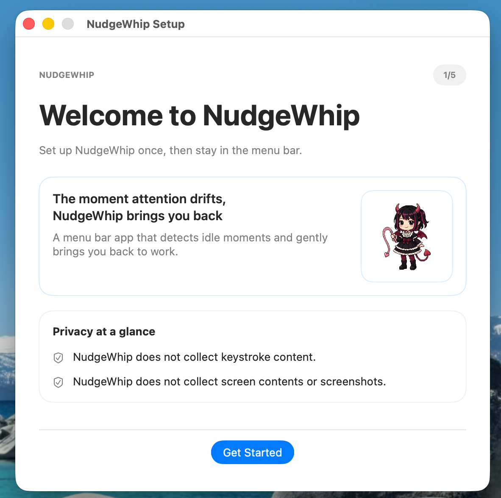
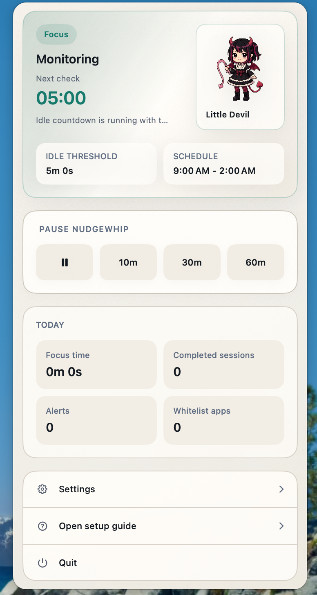

<p align="center">
  
</p>

<p align="center">
  <a href="LICENSE">
    
  </a>
  <a href="docs/release/v0.1.0.md">
    
  </a>
  
  
  
</p>

<h1 align="center">NudgeWhip</h1>

<p align="center">
  <strong>A sharp little devil for drifting attention.</strong>
</p>

<p align="center">
  NudgeWhip is a privacy-first macOS menu bar companion for serious desktop work.<br />
  It catches the moment attention slips, then snaps you back before a short drift becomes a lost hour.
</p>

<p align="center">
  <a href="docs/assets/readme/nudgewhip-alert-demo.mp4">
    
  </a>
</p>

<p align="center">
  <em>Click the preview to open the sound-on alert demo.</em>
</p>

<p align="center">
  <a href="docs/release/v0.1.0.md"><strong>Release Notes</strong></a>
  ·
  <a href="docs/release/v0.1.0-rc-checklist.md"><strong>RC Checklist</strong></a>
  ·
  <a href="docs/privacy/accessibility-and-data-disclosure.md"><strong>Privacy</strong></a>
  ·
  <a href="https://github.com/Lbin91/nudgewhip/issues"><strong>Issues</strong></a>
  ·
  <a href="https://github.com/Lbin91/nudgewhip/releases"><strong>Releases</strong></a>
</p>

## Why NudgeWhip

Most focus tools drift toward one of two extremes:

- they politely whisper and get ignored
- they escalate into blockers and create friction

NudgeWhip sits in the middle.

It is an `attention recall tool`: a local intervention layer for people whose work already lives inside demanding Mac workflows. The core idea is simple:

- drifting is normal
- recovery is the moment that matters
- the intervention should be immediate, clear, and local

## Release Status

`v0.1.0` is the first public beta for the macOS core loop.

Current release lane:

- `macOS-only`
- `source-first GitHub release`
- `Free core loop only`

Not in scope for `v0.1.0`:

- iPhone companion app
- CloudKit sync
- Pro packaging
- richer exception handling and advanced whitelist workflows
- expanded progression systems

## What Ships In `v0.1.0`

This beta already includes a real working loop:

- menu bar app with `LSUIElement` behavior and no Dock icon
- Accessibility permission onboarding with visible limited-mode fallback
- global idle detection from keyboard and mouse activity
- one-shot idle deadlines instead of noisy polling
- local visual nudges
- system notification escalation
- runtime status and countdown in the dropdown
- manual pause controls in the dropdown
- schedule controls
- local daily summary stats
- settings window and launch-at-login toggle
- Korean and English localization

## Onboarding

<p align="center">
  
</p>

## In The Menu Bar

<p align="center">
  
</p>

<p align="center">
  <em>The little devil lives in the menu bar and steps in when attention starts to slide.</em>
</p>

## What Makes It Different

### Local-first

NudgeWhip is designed around the Mac itself, not around a cloud dashboard.

### Privacy-first

Accessibility permission is used only to detect global input activity. NudgeWhip does **not** read typed text, capture your screen, inspect browsing history, or collect message content.

### Recovery-first

This is not a punishment machine. It is an intervention layer designed to shorten the distance between distraction and return.

## Privacy At A Glance

NudgeWhip draws a hard line:

- it uses global input activity only
- it does not inspect typed text or screen contents
- it does not store raw input logs
- it stores summary data locally
- it keeps local app state in `SwiftData`

Full disclosure: [docs/privacy/accessibility-and-data-disclosure.md](docs/privacy/accessibility-and-data-disclosure.md)

## Build And Verify

Requirements:

- macOS `15.0+`
- Xcode `17+`

Build the app:

```bash
xcodebuild build -scheme nudgewhip -destination 'platform=macOS'
```

Run static analysis:

```bash
xcodebuild analyze -scheme nudgewhip -destination 'platform=macOS'
```

Run unit and runtime tests:

```bash
xcodebuild test -scheme nudgewhip -destination 'platform=macOS' -only-testing:nudgewhipTests
```

Run UI tests:

```bash
xcodebuild test -scheme nudgewhip -destination 'platform=macOS' -only-testing:nudgewhipUITests
```

Note:

- menu bar agent UI tests are more timing-sensitive than standard foreground app UI tests
- release verification steps are tracked in [docs/release/v0.1.0-rc-checklist.md](docs/release/v0.1.0-rc-checklist.md)

## Technical Shape

Core stack:

- `SwiftUI` for menu bar, onboarding, and settings UI
- `AppKit` for global event monitoring and alert/panel coordination
- `SwiftData` for local persistence

At a high level:

1. NudgeWhip records the last observed activity timestamp.
2. It schedules a one-shot idle deadline.
3. When the deadline is reached, it starts a local nudge flow.
4. When activity returns, it resets the timer and records local summary data.

## Repository Layout

```text
nudgewhip/
├── nudgewhip/              # app source
├── nudgewhipTests/             # unit and runtime tests
├── nudgewhipUITests/           # UI tests
└── docs/                   # product, architecture, privacy, QA, and release docs
```

## Documentation Map

- [docs/release/v0.1.0.md](docs/release/v0.1.0.md): public beta release notes
- [docs/release/v0.1.0-rc-checklist.md](docs/release/v0.1.0-rc-checklist.md): release candidate execution checklist
- [docs/release/release-readiness-checklist.md](docs/release/release-readiness-checklist.md): release gate matrix
- [docs/privacy/accessibility-and-data-disclosure.md](docs/privacy/accessibility-and-data-disclosure.md): permission and data disclosure

## Beta Reality

This repository is not a concept dump.

It is an active public-beta / portfolio-stage product:

- the core loop is real
- the app builds and runs
- the release process is documented
- the surface area is still tightening

## License

This project is licensed under the [MIT License](LICENSE).
