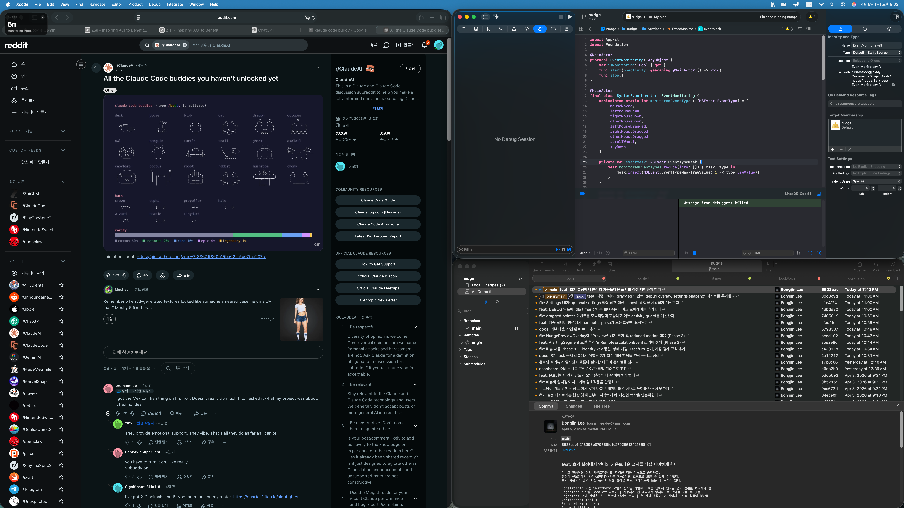
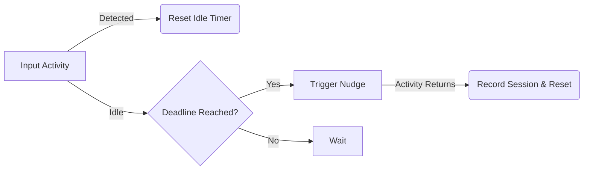

<p align="center">
  
</p>

<p align="center">
  <a href="https://github.com/Lbin91/nudge/releases">
    
  </a>
  
  
  
</p>

<h1 align="center">Nudge (넛지)</h1>

<p align="center">
  <strong>The moment attention drifts, Nudge brings you back.</strong>
</p>

<p align="center">
  Not a blocker. Not a guilt machine. Not surveillance.<br />
  A calm, privacy-first macOS menu bar app that catches the quiet moment when work slips away and gives you a clean path back in.
</p>

<p align="center">
  <a href="#-the-pitch">The Pitch</a> •
  <a href="#-core-features">Features</a> •
  <a href="#-how-it-works">How it Works</a> •
  <a href="#-roadmap">Roadmap</a> •
  <a href="#-privacy">Privacy</a> •
  <a href="#-korean">한국어</a>
</p>

---

## 🎯 The Pitch

Most focus tools are built like walls. **Nudge is built like a tap on the shoulder.**

It lives in your menu bar, observing idle moments through global input activity. When your rhythm breaks, it responds with a gentle nudge. The goal isn't to punish distraction—it's to shorten the distance between drifting and returning.

> "Designed for developers, designers, writers, and anyone living in long, attention-sensitive desktop workflows."

---

## ✨ Core Features

<table width="100%">
  <tr>
    <td width="50%" valign="top">
      <h4>🕵️ Quiet Detection</h4>
      Detects idle/offline distraction via global input activity (mouse/keyboard) without reading what you type.
    </td>
    <td width="50%" valign="top">
      <h4>🔔 Gentle Recovery</h4>
      Multi-stage nudges from subtle visual cues to optional voice alerts to bring you back to the flow.
    </td>
  </tr>
  <tr>
    <td width="50%" valign="top">
      <h4>📊 Focus Insights</h4>
      Local-first daily summary stats to help you understand your focus patterns over time.
    </td>
    <td width="50%" valign="top">
      <h4>⚙️ Schedule & Whitelist</h4>
      Full control over when Nudge is active and which applications are exempt from monitoring.
    </td>
  </tr>
  <tr>
    <td width="50%" valign="top">
      <h4>🔒 Privacy by Design</h4>
      No screen recording, no keystroke logging, no cloud syncing (unless you opt-in for Pro).
    </td>
    <td width="50%" valign="top">
      <h4>🚀 Native Experience</h4>
      Built with SwiftUI and AppKit for a lightweight, energy-efficient macOS native performance.
    </td>
  </tr>
</table>

---

## 🛠 How It Works

Nudge uses a sophisticated but lightweight local loop to manage your attention:



1.  **Observe:** Records the last observed activity timestamp using `NSEvent` global monitors.
2.  **Wait:** Schedules a one-shot idle deadline based on your settings.
3.  **Nudge:** Triggers a recovery flow (visual/audio) when the deadline passes.
4.  **Recover:** Resets the timer and logs the focus session locally upon your return.

---

## 🗺 Roadmap

- [x] **v0.1.0 Core Loop:** Menu bar runtime, global idle detection, local nudges.
- [x] **v0.1.0 Onboarding:** Accessibility permission flow and schedule controls.
- [ ] **Next Up: iPhone Companion:** Cross-device escalation for when you drift away from the Mac entirely.
- [ ] **CloudKit Sync:** Private database sync between macOS and iOS devices.
- [ ] **Gamification:** Virtual pet system that grows as you maintain your focus.

---

## 🛡 Privacy

Nudge draws a hard line on data collection:
- **Keystrokes:** We detect *that* you typed, not *what* you typed.
- **Screen:** We never capture screenshots or record your screen.
- **Browsing:** Your history remains private; we don't inspect URLs.
- **Local First:** All data stays on your machine by default.

Full disclosure: [Privacy & Data Disclosure](docs/privacy/accessibility-and-data-disclosure.md)

---

## 🏗 Tech Stack

| Layer | Technology |
|---|---|
| **UI** | SwiftUI (macOS 15.0+) |
| **Engine** | AppKit (NSEvent Global Monitoring) |
| **Persistence** | SwiftData |
| **Sync** | CloudKit (Planned) |
| **Automation** | Xcodebuild & XCTest |

---

## 🚀 Getting Started

**Build from source:**
```bash
xcodebuild build -scheme nudge -destination 'platform=macOS'
```

**Run Tests:**
```bash
xcodebuild test -scheme nudge -destination 'platform=macOS'
```

---

<p align="center">
  Built with ❤️ for the focused mind.
</p>
